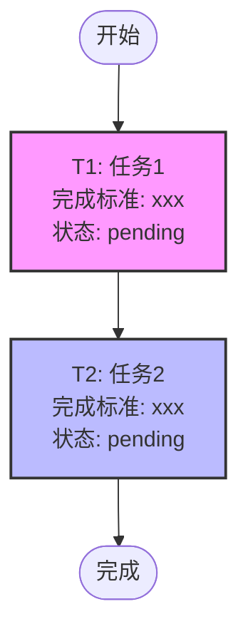

# AGI Agent - Claude Code 配置指南

> 本文件为 Claude Code 提供 AGI Agent 项目的上下文、编码规范和开发指南。

---

## 📖 项目概述

**AGI Agent** 是一个多智能体任务执行平台，支持：
- Vibe Doc（图文文档创作）
- Vibe Coding（编程辅助）
- 自然语言通用任务执行

### 核心特性

| 特性 | 说明 |
|------|------|
| 多智能体架构 | Manager + 多子 Agent 协作，支持自组队、自配置 |
| ReAct 执行引擎 | Plan → Act → Observe → Reflect 多轮迭代 |
| 40+ 工具生态 | 内置工具 + OS 命令 + MCP 扩展 |
| 双层记忆系统 | 短期记忆 + 长期语义检索 |
| 多格式输出 | Markdown / Word / PDF / LaTeX 无损转换 |
| 中英文支持 | 界面和 SVG/Mermaid 中文优化 |

### 适用场景

- 代码开发与调试
- 专业文档生成（报告、论文、专利）
- 数据分析与可视化
- 网页应用开发
- 多智能体协作任务

---

## 📁 项目结构

```
AGIAgent/
├── agia.py                      # CLI 入口脚本
├── src/
│   ├── main.py                  # 主程序（含 Python 库接口 AGIAgentClient）
│   ├── multi_round_executor/     # 多轮任务执行引擎
│   │   └── executor.py          # MultiRoundTaskExecutor 类
│   ├── tools/                   # 工具实现
│   │   ├── base_tools.py        # 基础工具类
│   │   ├── file_system_tools.py # 文件操作工具
│   │   ├── code_search_tools.py # 代码搜索工具
│   │   ├── web_search_tools.py  # 网络搜索工具
│   │   ├── image_tools.py       # 图像处理工具
│   │   └── ...
│   ├── api_callers/             # API 调用封装
│   ├── mem/                     # 记忆系统
│   ├── experience/              # 经验模块
│   └── config_loader.py         # 配置加载器
├── prompts/                     # 提示词配置
│   ├── system_prompt.txt        # 系统主提示词
│   ├── tool_prompt.json         # 工具定义（JSON Schema）
│   ├── rules_prompt.txt         # 工具调用规则
│   ├── system_plan_prompt.txt   # Plan 模式提示词
│   └── additional_tools.json    # 可选工具
├── config/                      # 配置文件
│   ├── config.txt               # 主配置（API 密钥、模型等）
│   ├── mcp_servers.json         # MCP 服务器配置
│   └── config_memory.txt        # 记忆配置
├── routine/                     # 技能模板（中文）
├── routine_zh/                  # 技能模板（英文）
├── GUI/                         # Web 界面
│   └── app.py                   # Flask Web 应用
├── docs/                        # 技术文档
└── md/                          # 使用指南

# Claude Code 相关文件
└── CLAUDE.md                    # 本文件
```

---

## 🚀 常用命令

### CLI 模式

```bash
# 基本使用
python agia.py "写一个 Python 计算器"

# 指定输出目录
python agia.py "写一个笑话" --dir "my_dir"

# 继续上次任务
python agia.py -c

# 设置执行轮数
python agia.py --loops 5 -r "需求描述"

# 自定义模型配置
python agia.py --api-key YOUR_KEY --model gpt-4 --api-base https://api.openai.com/v1

# 指定技能模板
python agia.py "写一篇论文" --routine routine_zh/核心循环引擎.md
```

### GUI 模式

```bash
# 启动 Web 界面
python GUI/app.py --port 5001

# 访问 http://localhost:5001
```

### Python 库模式

```python
from src.main import AGIAgentClient, create_client

# 初始化客户端（自动读取 config/config.txt）
client = AGIAgentClient(
    debug_mode=False,
    single_task_mode=True  # 推荐使用单任务模式
)

# 发送任务
response = client.chat(
    messages=[
        {"role": "user", "content": "创建一个 Python 计算器"}
    ],
    dir="my_calculator",  # 输出目录
    loops=10              # 最大执行轮数
)

# 检查结果
if response["success"]:
    print(f"任务完成! 输出目录: {response['output_dir']}")
else:
    print(f"任务失败: {response['message']}")
```

---

## 📐 编码规范

### Python 代码风格

```python
#!/usr/bin/env python3
# -*- coding: utf-8 -*-
"""
Copyright (c) 2025 AGI Agent Research Group.

Licensed under the Apache License, Version 2.0 (the "License");
...
"""

# 模块导入顺序：标准库 → 第三方库 → 本地模块
import os
import sys
from typing import Dict, List, Optional

from src.tools import Tools
from src.config_loader import get_api_key

# 常量命名：全大写加下划线
MAX_RETRY_COUNT = 3
DEFAULT_TIMEOUT = 30

# 类名：CapWords 风格
class TaskExecutor:
    """任务执行器类"""
    
    def __init__(self, config: Dict) -> None:
        """初始化执行器
        
        Args:
            config: 配置字典
        """
        self.config = config
```

### 文件操作规范

- **使用 UTF-8 编码**：所有 Python 文件添加 `# -*- coding: utf-8 -*-`
- **中文注释优先**：代码注释使用中文，提高可读性
- **类型提示**：函数参数和返回值建议添加类型注解
- **文档字符串**：类和公共方法添加 docstring

### 工具定义格式

工具定义在 `prompts/tool_prompt.json` 中，使用 JSON Schema 格式：

```json
{
  "tool_name": {
    "description": "工具用途描述",
    "parameters": {
      "type": "object",
      "properties": {
        "param_name": {
          "type": "string",
          "description": "参数说明"
        }
      },
      "required": ["param_name"]
    }
  }
}
```

---

## 🤖 Agent 核心机制

### ReAct 执行循环

```
┌─────────────────────────────────────────────┐
│                 Plan                        │
│  分析任务，创建/更新 plan.md 任务图           │
└─────────────────┬───────────────────────────┘
                  ↓
┌─────────────────────────────────────────────┐
│                 Act                         │
│  调用工具执行任务                            │
└─────────────────┬───────────────────────────┘
                  ↓
┌─────────────────────────────────────────────┐
│               Observe                       │
│  获取工具执行结果                            │
└─────────────────┬───────────────────────────┘
                  ↓
┌─────────────────────────────────────────────┐
│               Reflect                        │
│  根据结果判断是否完成或继续                   │
└─────────────────────────────────────────────┘
```

### plan.md 任务图格式

Agent 在执行任务前会创建/更新 `plan.md`，使用 Mermaid 流程图：



**节点类型：**
- **Task Node**：具体执行任务
- **Choice Node**：多分支选择
- **Loop Node**：循环任务
- **Start/End Node**：开始/结束节点

**节点属性：**
- `ID`：唯一标识
- `Task Description`：任务描述
- `Completion Criteria`：完成标准
- `Agent ID`：执行者（如 manager、agent_001）
- `Status`：状态（pending/in_progress/completed/failed）

### TASK_COMPLETED 信号

```python
# 任务完成时发送信号
TASK_COMPLETED: [简要描述完成内容]

# 注意：
# 1. 只有 manager 可发送此信号
# 2. 子 agent (agent_001 等) 不可编辑 plan.md
# 3. 如果当前轮调用了工具，需等待下一轮再发送
# 4. 不做超出用户需求的额外迭代
```

### 继续模式

当收到继续任务时：
1. 读取 `log/manager.out` 获取历史对话
2. 在历史上下文基础上继续执行
3. 可合并新的需求与历史任务

---

## 🛠️ 工具系统

### 核心工具列表

| 工具名 | 用途 | 使用要点 |
|--------|------|----------|
| `workspace_search` | 语义搜索代码 | 使用自然语言描述搜索需求 |
| `read_multiple_files` | 批量读取文件 | 最多 20 个文件，每次最多 500 行 |
| `edit_file` | 编辑文件 | 推荐使用 `lines_replace` 模式 |
| `grep_search` | 正则文本搜索 | 排除 `__pycache__/*` 等目录 |
| `run_terminal_cmd` | 执行终端命令 | 避免 pager，命令末尾加 `\| cat` |
| `web_search` | 网络搜索 | 结果保存到 `workspace/web_search_result/` |
| `fetch_webpage_content` | 抓取网页内容 | 可指定搜索关键词高亮 |
| `search_img` | 搜索图片 | 先 Google，后 Baidu/Bing |
| `create_img` | AI 生成图片 | 使用 cogview-3-flash 模型 |
| `read_img` | 图像识别 | 使用 vision_model 配置的模型 |
| `merge_file` | 合并文件 | Markdown 自动转 Word/PDF |
| `convert_docs_to_markdown` | 文档转换 | 支持 docx/xlsx/html/tex/pptx/pdf |
| `compress_history` | 压缩历史 | 手动触发对话历史压缩 |
| `talk_to_user` | 用户交互 | 可设置超时时间 |

### edit_file 使用模式

```python
# 精确替换（推荐）
edit_file(
    target_file="src/main.py",
    edit_mode="lines_replace",
    old_code="def hello():\n    print('world')",
    code_edit="def hello():\n    print('Hello, AGI Agent!')"
)

# 追加到文件末尾（最安全）
edit_file(
    target_file="src/new_file.py",
    edit_mode="append",
    code_edit="# 新文件内容\ndef new_function():\n    pass"
)

# 完全替换文件
edit_file(
    target_file="src/main.py",
    edit_mode="full_replace",
    code_edit="完整的新文件内容..."
)
```

### run_terminal_cmd 规范

```bash
# ✅ 正确：避免 pager
grep -r "TODO" src/ | cat
git log --oneline -10 | cat

# ❌ 错误：可能阻塞
git log  # 会进入交互式 pager
```

### Web 搜索结果处理

搜索结果保存到 `workspace/web_search_result/`，结构：
```
workspace/web_search_result/
├── search_results.html  # 原始 HTML
├── search_results.txt   # 提取文本
└── [url].txt           # 各页面内容
```

---

## ⚙️ 配置指南

### config.txt 主要字段

```ini
# 语言设置
LANG=zh  # en/zh

# 模型配置（必需）
api_key=your_api_key
api_base=https://api.openai.com/v1
model=claude-sonnet-4-0
max_tokens=16384

# 流式输出
streaming=True

# 长期记忆
enable_long_term_memory=True

# 工具调用格式
Tool_calling_format=False  # False 使用 chat-based，True 使用 standard
tool_call_parse_format=xml  # json/xml

# 历史压缩
summary_trigger_length=100000
compression_strategy=llm_summary  # delete/llm_summary

# Web 界面配置
gui_default_data_directory=./data

# 多智能体
multi_agent=False
enable_round_sync=True
sync_round=5
```

### 环境变量

```bash
# 也可通过环境变量设置
export AGIAGENT_API_KEY=your_key
export AGIAGENT_API_BASE=https://api.openai.com/v1
export AGIAGENT_MODEL=claude-sonnet-4-0
```

### MCP 服务器配置

`config/mcp_servers.json` 示例：
```json
{
  "servers": [
    {
      "name": "filesystem",
      "command": "npx",
      "args": ["-y", "@modelcontextprotocol/server-filesystem", "./workspace"]
    }
  ]
}
```

---

## 🔧 开发指南

### 添加工具流程

1. 在 `prompts/tool_prompt.json` 中添加工具定义
2. 在 `src/tools/` 中实现工具类
3. 在 `src/tools/__init__.py` 中注册
4. 测试工具调用

### 自定义提示词

| 文件 | 用途 | 修改说明 |
|------|------|----------|
| `prompts/system_prompt.txt` | 系统主提示词 | 定义 Agent 角色和行为 |
| `prompts/rules_prompt.txt` | 工具调用规则 | 规范工具使用方式 |
| `prompts/user_rules.txt` | 用户需求补充 | 添加额外指令 |
| `prompts/system_plan_prompt.txt` | Plan 模式 | 任务分解逻辑 |

### 多智能体配置

```python
# 启用多智能体模式
# config.txt 中设置
multi_agent=True

# 可用工具：spawn_agent, send_to_agent, broadcast_to_agents
# 每个 Agent 有独立的工作区和工具配置
```

### 调试与日志

```python
# 启用调试模式
python agia.py --debug "任务"

# 日志位置
output/logs/
├── manager.out      # 主 Agent 对话记录
├── executor.out     # 子 Agent 对话记录
└── debug/           # 详细调试信息
```


---

## 📝 注意事项

1. **文件路径**：优先使用相对于 workspace 的路径
2. **中文处理**：Mermaid/SVG 中文已优化，直接使用即可
3. **继续任务**：先读取 `log/manager.out` 了解上下文
4. **任务完成**：发送 TASK_COMPLETED 信号后停止，不要做额外迭代
5. **plan.md**：只有 manager 可更新，子 agent 不可修改

---

## 🔗 相关资源

- [项目主页](https://github.com/agi-hub/AGIAgent)
- [使用手册](./md/user_guide.pdf)
- [Python 库文档](./md/README_python_lib_zh.md)
- [MCP 集成指南](./md/README_MCP_zh.md)